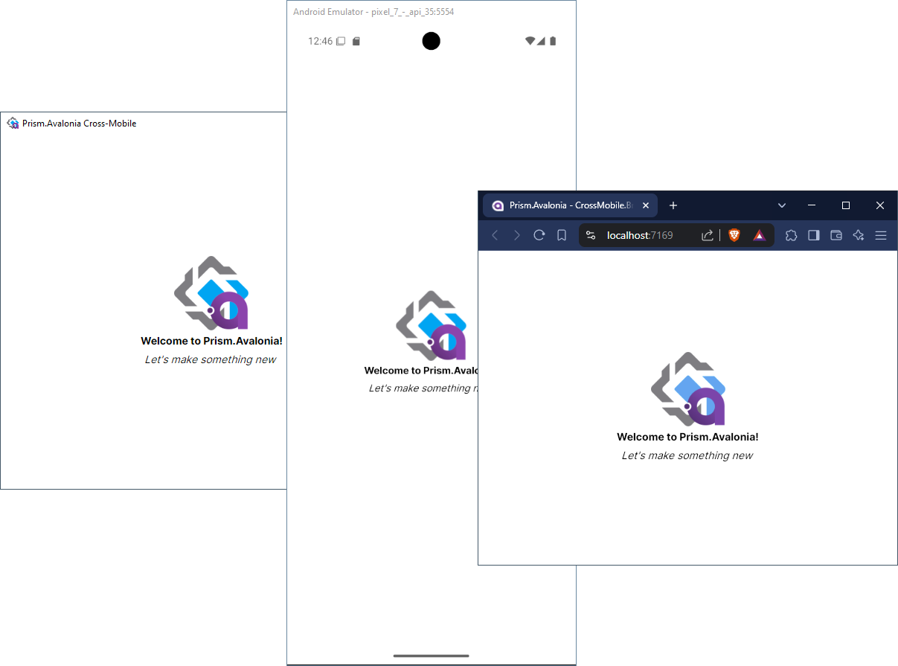

# Introduction

The **Learn PrismLibrary** repository provides a variety of samples across different framework implementations such as, Xamarin.Forms, Uno, WPF, and Avalonia, all using Prism!

Each of the samples uses DryIoc for Dependency Injection and is based off of their respective Visual Studio template.

Enjoy! 
Author: [Damian Suess](https://www.linkedin.com/in/damiansuess/) 
Website: [suesslabs.com](https://suesslabs.com)

## About Prism Library

Prism is a framework for building loosely coupled, maintainable, and testable XAML applications in .NET MAUI, Avalonia, WPF, and Windows 10 UWP. Separate releases are available for each platform and those will be developed on independent timelines. Prism provides an implementation of a collection of design patterns that are helpful in writing well-structured and maintainable XAML applications, including MVVM, dependency injection, commands, EventAggregator, and others. Prism's core functionality is a shared code base in a Portable Class Library targeting these platforms.

## Samples Table

### [Prism.Avalonia](https://github.com/AvaloniaCommunity/Prism.Avalonia)

#### v9.0

| Name                        | Prism Ver. | Level | Details |
|-|-|-|-|
| Ex 1 - Basic MVVM App       | 9.0.x | Intro | Basic single page app with MVVM bindings.
| Ex 2 - Intro to Dialogs     | 9.0.x | Intro | Pop-up Dialog samples.
| Ex 3 - SplitView Navigation | 9.0.x | Intro | Similar to Ex1 but with Avalonia's `SplitView` control.
| Ex 4 - All Features         | 9.0.x | Intro | Navigation and Regions, journaling navigation, Notification Pop-ups, and basic MVVM.
| Ex 5 - Navigation Animation | 9.0.x | Pro | Custom navigation animations (Level: Pro)

#### v8.1

| Name                        | Prism Ver. | Details |
|-|-|-|
| Ex 1 - Intro to Navigation  | 8.1.97 | Prism Regions with navigation, journaling navigation, Notification Pop-ups, and basic MVVM.
| Ex 2 - Intro to Dialogs     | 8.1.97 | Pop-up Dialog samples.
| Ex 3 - SplitView Navigation | 8.1.97 | Similar to Ex1 but with Avalonia's `SplitView` control.

_Coming Soon:_

* Prism.Avalonia v9.0-pre
* Events
* Modules
* Navigation tips and tricks

### Prism.Maui

The Prism.Maui examples currently require the NuGet package, Prism.DryIoc.Maui. If you plan on using just, Prism.Maui, then the startup fluent arguments are slightly different. An example for such a case is scoped on the backlog.

| Name                        | Prism Ver. | Details |
|-|-|-|
| Ex 1 - Intro Welcome        | 8.1 | Introduction to View/ViewModel registration and navigation.
| Ex 2 - Basic Navigation     | 8.1 | Sample navigation.
| Ex 3 - Splash Screen        | 8.1 | _(Work-in-Progress)_ Demonstrate loading screen.
| Ex 4 - Microsoft DI _(TBD)_ | 8.1 | _Coming Soon_

### [Prism.Forms](https://github.com/PrismLibrary/Prism)

| Name                        | Prism Ver. | Details |
|-|-|-|
| Ex 1 - Intro to Navigation  | 7.0 | Introduction to View/ViewModel registration and navigation.
| Ex 2 - Master Detail Page   | 7.1 | Navigation using the MasterDetailPage. Xamarin.Forms has since renamed the control to, "FlyoutPage". We're keeping the name for historical purposes.
| Ex 3 -Tab Page              | 7.1 | Navigation using the TabbedPage user control.
| Ex 4 - (Coming Soon)        | 8.1 | Sample pop-up and dialogs
| Ex 5 - Partial Content View | 7.1 | Prism's `AutowirePartialView` is a legacy feature that has since been replaced with `Region` support in v8.x. Reference, [this post](https://stackoverflow.com/a/61503648/249492) by Dan Siegel.
| Ex 6 - v7.2 Features        | 7.2 | Prism v7.2 features (_legacy_)
| Ex 7 - v7.2 Template        | 7.2 | Prism.Forms v7.2 Template Project (_legacy_)
| Ex 8 - v8.1 Template        | 8.1 | Prism.Forms v8.1 Template Project
| Ex 9 - GTK Intro            | 8.1 | Basic GTK# project files to get started
| Ex 10 - GTK Navigation      | 8.1 | GTK# navigation sample
| Ex 11 - Shiny.NET Core      | 8.1 | Basic Shiny.NET components needed before beginning any Shiny project with Prism.Forms.

### [Prism.Uno](https://github.com/PrismLibrary/Prism)

| Name                        | Prism Ver. | Details |
|-|-|-|
| Ex 1 - Basics               | 8.1 | Prism.Uno sample targets Linux with GTK, and Windows via UWP.

### [Prism.WPF](https://github.com/PrismLibrary/Prism)

| Name                        | Prism Ver. | Details |
|-|-|-|
| Ex 1 - Full App Template    | 8.0 | Prism.WPF sample app with Regions, Modules, and navigation (_.NET Framework 4.8_)
| Ex 2 - Region Navigation    | 8.0 | Navigation using Regions (_.NET Framework 4.8_)
| Ex 3 - Module Permissions   | 8.1 | Module permissions sample using .NET 5 - Based on [Brian Lagunas' Pluralsight course](https://app.pluralsight.com/library/courses/prism-loading-modules-user-roles)

## AvaloniaUI Samples

All AvaloniaUI samples are cross-platform ready!  That's right, you can use Linux, Mac, Windows, or Windows with WSL.

In these lessons repo, we'll explore how to wire-up Avalonia with Prism.Avalonia and some of the key user controls that Avalonia has to offer.

Whether you're coming from WPF, Xamarin.Forms, Uno, or some other XAML based language, you'll find a lot of exact syntactical matches and similarities. Overall, **Prism.Avalonia** is a solid tool for production cross-platform applications.

## WPF Samples

List of Prism Snippets:

* [X]  Prism Library Sample Full App
* [X]  Basic Regions with Navigation and Service wire-ups
* [/]  Basic Modules (_work in progress_)
* [ ]  Dynamic Tab Regions

### WPF - Ex1 - Full App Template

* Main Program
* Module 1 - Login Screen Module
* Module 2 - Basic Inventory Management Module, with personalized services.
* Module 3 - Logging Module, shared by both Modules
* Services - Shared services

### WPF - Ex2 - Basic Regions

Demonstrates how to configure regions, perform navigation, and wire up services with Dependendency Injection. There are 2 regions, a sidebar and a content region where the main body of work is performed.

### WPF - Ex3 - Basic Modules

Demonstrates how to interact with multiple modules from your main form and share common services, plus personalized services to the module.

Here we'll use basic login system to gain access to our inventory manager

### WPF - Ex4 - Material Design

Make it pretty

COMING SOON: MahApps.Metro + MaterialDesign

## Semi-Requirements

The project works best if you include the [Prism Template Pack](https://marketplace.visualstudio.com/items?itemName=BrianLagunas.PrismTemplatePack). This allows the system to quickly type in code for you and _even creates a ViewModel class when you create a new page_!

## Future Samples

* [ ] [Metro Themes](https://github.com/MahApps/MahApps.Metro)
  * [WPF sample app](https://github.com/sakurabayusuke/Book-Manager)

## Resources

* [Prism Library](https://prismlibrary.github.io/)
* [Prism on GitHub](https://github.com/PrismLibrary/Prism)
* [Prism Template Pack](https://marketplace.visualstudio.com/items?itemName=BrianLagunas.PrismTemplatePack)
* [Prism official samples](https://github.com/PrismLibrary/Prism-Samples-Forms)
* [Plugin Popups](https://github.com/dansiegel/Prism.Plugin.Popups)

### Learn

* [Prism for Xamarin.Forms - Create your first application](https://www.youtube.com/watch?v=81Q2fxFWIqA) - Created 2018-12-04
* [The Xamarin Show | Episode 10: Prism for Xamarin.Forms with Brian Lagunas](https://www.youtube.com/watch?v=mb3_vhYw1mA) - Created 2018-01-04 _Prism v6_
* [Xamarin Forms with Prism — Getting Started — Part 1](https://medium.com/tutorialsxl/xamarin-forms-with-prism-getting-started-part-1-14832d7cf5fa) - Created 2018-03-23

[SuessLabs.com](https://suesslabs.com/) - [Suess Labs (GitHub)](https://github.com/SuessLabs) - [Damian Suess (GitHub)](https://github.com/DamianSuess)

## License

Copyright (c) 2024 Xeno Innovations, Inc.. All rights reserved.

